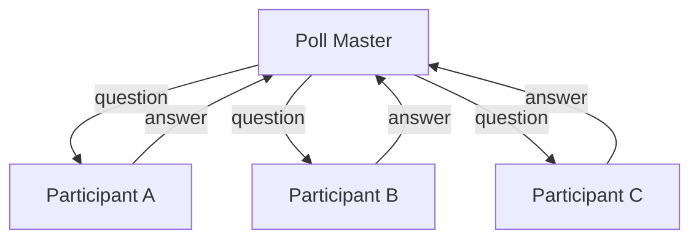
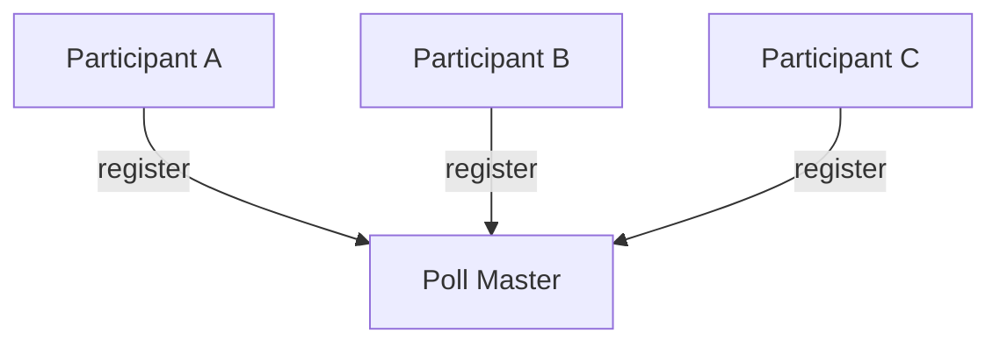
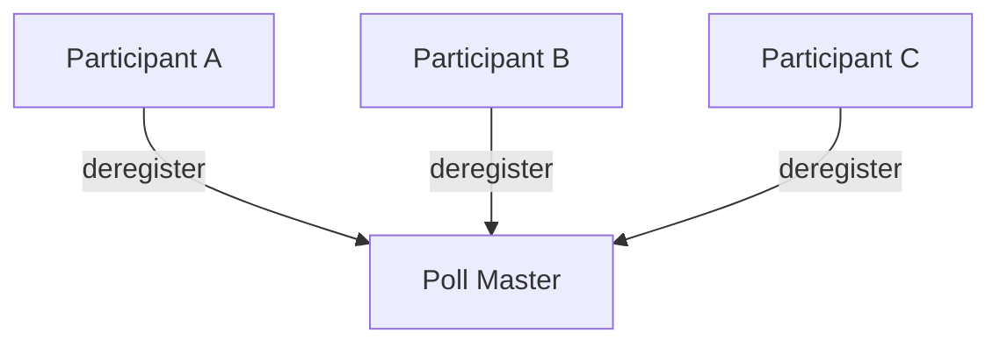
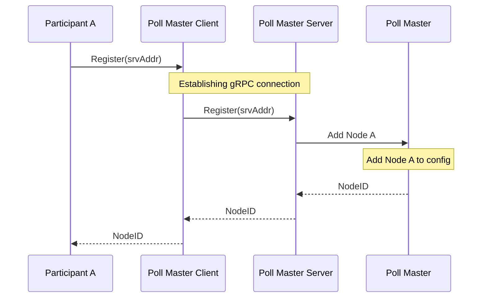
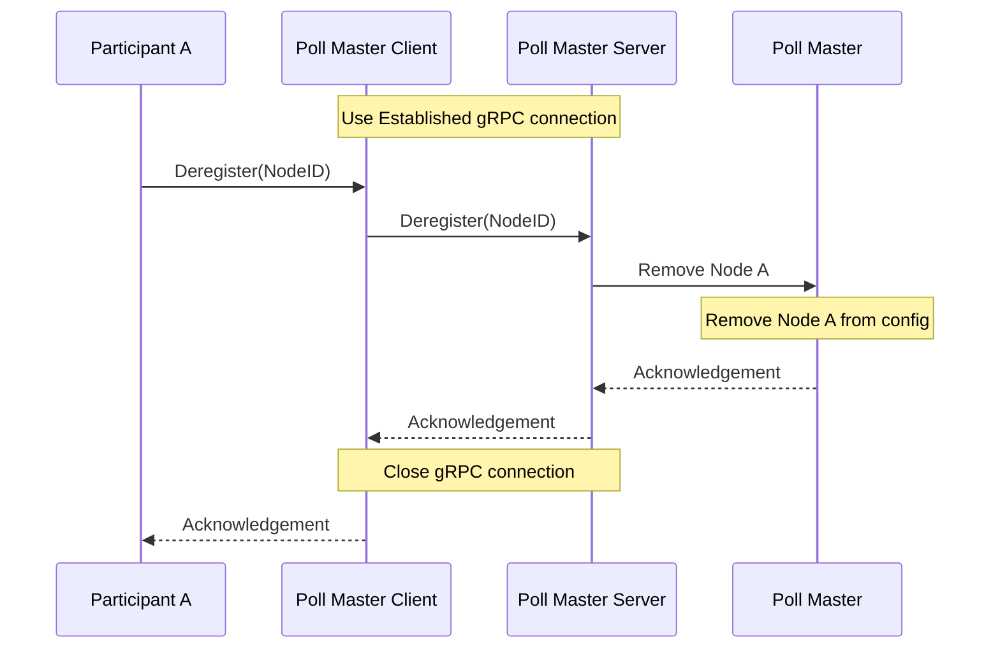
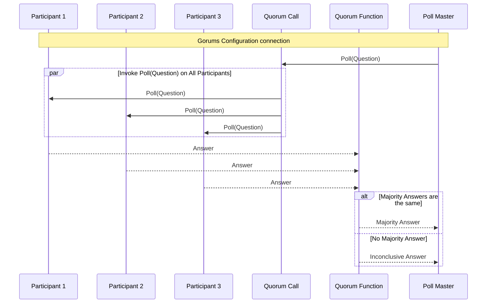

# Polling Service

Before implementing this assignment, please check the example programs of [gRPC][grpc] and [Gorums][gorums].
Please read about various [method options][methods] available in Gorums to understand how to apply these options as needed.
Upon thorough understanding of these examples proceed to the following details.

## System Description

In this task you should implement a basic polling service.
The service should consist of two types of members.
The poll master and the participants.
The goal of the service is to allow the poll master to send questions to the participants and receive answers from them as shown in the figure below.



However, before the poll master can send questions to the participants, the participants must register with the poll master.



Once the participants wants to stop receiving questions they should deregister with the poll master.



### Participants

When the `Register(srvAddr)` method on the `participant` struct is called it should register with the polling service.
After it has registered it begins receiving questions from the poll master.
The questions should be sent to a `QuestionHandler` which provides a `Response` to the provided `Question`.
The `Response` should be returned to the poll master.
The participant continues receiving questions until the `Deregister()` function is called.

### PollMaster

The poll master works as a manager of the polling service.
When an application wants to send a `Question` it calls the `HandleQuestion()` function of the poll master.
The poll master sends the question to all registered participants and awaits responses from all of them.
When it receives responses from the participants it checks if a majority of participants provided the same answer.
If that is the case return that answer, otherwise it returns an `InconclusiveAnswer`.

## Task

A skeleton code of the service has been provided.
This includes a `participant` type and a `master` type.
These types have several method templates with steps explaining what should be implemented.

In addition to a skeleton code the provided code includes a [defs.go](defs.go) file.
This files includes some constants, such as timeout values, that can be used.
The file also contains three interfaces that are used, and some information about them.
The `PollMaster` and `PollParticipant` interfaces are used in the tests, while the `master` and `participant` types should implement these interfaces.
**This is necessary for the tests to compile.**
The `QuestionHandler` interface defines a type that can receive a question and provides a corresponding response to the question.
It should be used in the participant to provide a response to a question received from the poll master.

In [Part 1](#part-1-implement-register-and-deregister-processes) you will implement the register and deregister processes.
Additionally you will implement some helper functions used for testing.
These functions must be implemented correctly for the tests in Part 2 to work.

[Part 2](#part-2-implement-polling-of-registered-participants) involves implementing the `HandleQuestion` method on the `master` struct,
and code for the participant to receive the question and respond with an answer.

In addition to the skeleton code, an application using the polling service has been provided.
It can be used to verify your implementation of the polling service.
It can be found in the [`cmd`](cmd/) folder.
The [`cmd/pollmaster/main.go`](cmd/pollmaster/main.go) file allows you to start the server on the address specified with the `srvAddr` flag.
To start the server running on `localhost:50000` use the command:

```shell
go run cmd/pollmaster/main.go -srvAddr=:50000
```

The [`cmd/participant/main.go`](cmd/participant/main.go) file allows you to start a participant.
It will connect to a server listening on the address specified with the `srvAddr` flag.
To connect to the server listening on `localhost:50000` use the command:

```shell
go run cmd/participant/main.go -srvAddr=:50000
```

### Part 1: Implement Register and Deregister Processes

In Part 1 the registration and deregistration part of the service should be implemented.
The participant should be able to register and deregister with the poll master.
After it has registered it should receive the questions sent by the poll master.
The register process should be started by calling the `Register()` method on the `participant` type.
Similarly, the deregister process should be started by calling the `Deregister()` method on the `participant` type.

Here are two sequence diagrams showing the register and deregister processes:





#### Task 1.0: Compile the proto files

We provide the necessary proto files containing the service definitions and messages.
The commands below can be used to compile the proto files.

```shell
protoc --go_out=paths=source_relative:. --go-grpc_out=paths=source_relative:. proto/pollmaster.proto
```

```shell
protoc -I=$(go list -m -f {{.Dir}} github.com/relab/gorums):. --go_out=paths=source_relative:. --gorums_out=paths=source_relative:. proto/pollparticipant.proto
```

#### Task 1.1: Implement the `PollMaster` interface

Implement the poll master as follows:

- The `NewPollMaster` function should:

  1. Create a new `master` instance with an empty Gorums `Configuration` object.

  2. Register the `PollMasterServer` and listen for incoming `Register` and `Deregister` calls on the specified address.

  3. Serve the `PollMasterServer` in a goroutine to make sure that the function is non-blocking.

  4. Return the `master` instance.

- Implement the `PollMaster` interface defined in [`defs.go`](defs.go) on the `master` type.

  1. The `SrvAddress()` method should:
     Return the address that the poll master is currently listening for incoming requests on.

  2. The `NumParticipants()` method should:
     Return the number of participants currently in the configuration

#### Task 1.2: Implement the `PollMasterServer` interface

- The `master` type should also implement the `PollMasterServer` interface.
  To do this it should implement the methods defined in the [`pollmaster.proto`](proto/pollmaster.proto) file.
  However, these gRPC service methods must first be compiled from the proto file into Go definitions.

  Once the proto file has been compiled, the Go definitions of the messages types can be found in the [`pollmaster.pb.go`](proto/pollmaster.pb.go) file.
  Similarly, the Go definitions of the gRPC service interfaces for the poll master client and server can be found in the [`pollmaster_grpc.pb.go`](proto/pollmaster_grpc.pb.go) file.

#### Task 1.3: Implement the `PollParticipant` interface

Implement the methods on the `participant` type according to the specifications below.
Make sure that the `participant` type implements the `PollParticipant` interface defined in [`defs.go`](defs.go).

Implement the poll participant as follows:

- The `NewParticipant` function should:

  1. Create a new `participant` instance and store the provided `QuestionHandler` in the `participant` instance.
     The `QuestionHandler` will be used to handle questions received from the poll master.

  2. Register the `PollParticipantServer` and listen for incoming `Poll` calls on the specified address.

  3. Serve the `PollParticipantServer` in a goroutine to make sure that the function is non-blocking.

  4. Return the `participant` instance.

- Implement the `PollParticipant` interface defined in [`defs.go`](defs.go) on the `participant` type.

  1. The `Register(string)` method should:

     - Create a `PollMasterClient` and send a request to register to it.
     - Store any variables needed to deregister, e.g., connections or the `PollMasterClient`.

  2. The `Deregister()` method should:

     - Send a request to deregister to the poll master using a `PollMasterClient`.
     - Clean up the connection to the poll master.
       Close any open connections.

### Part 2: Implement Polling of Registered Participants

In this part the polling of the service should be implemented.
The poll master should receive a question through the `HandleQuestion` method and send it to all registered participants using a _quorum call_.
Participants should handle the question and return an answer.
A _quorum function_ should be used to handle and aggregate the received answers.
The majority answer should then be returned by the poll master.
If there is no majority answer, an inconclusive answer should be returned.



#### Task 2.1 Implement the `QuestionHandler` interface

Implement the `QuestionHandler` interface defined in [`defs.go`](defs.go) on the `master` struct.

- The `HandleQuestion` method should:

  1. Send questions to all participants in the `Configuration` using the `Poll` quorum call.

     - If there are no participants in the configuration it should return a `errNoParticipants` error.

  2. Respond with a single unified response from all the participants.

To support the `HandleQuestion` method's need to unify many participant answers, you must also implement a quorum function.
A quorum function must implement the `QuorumSpec` interface defined in the [`pollparticipant_gorums.pb.go`](proto/pollparticipant_gorums.pb.go) file.
Thus, it is necessary to create a `qspec` type on which we can implement the `QuorumSpec` interface.

- The `qspec` type should:

  1. Store the size of the configuration.
     This will allow the quorum function can determine if a majority of answers have been received.

  2. Implement the `PollQF` method defined in the `QuorumSpec` interface.

- The `PollQF` method should:

  1. Handle replies from the quorum call as follows:

     - If there is a majority answer, return it.
       A majority means that more than half of the participants have answered with the same answer.
     - If there is no majority answer, but all participants have responded, return an `InconclusiveAnswer`.
     - If there is no majority answer by the time the `QuestionTimeout` has expired, return an `InconclusiveAnswer`.
       You can use contexts to achieve this.

  2. The replies must also be validated to ensure that valid responses have been received.
     Specifically:

     - The `id` of the response should match the `id` of the question sent in the quorum call.
     - The `answer` should be a value between `0` and the number of options.
       E.g., if there are 4 options, the `answer` can be either 0, 1, 2 or 3.
       It can also be `InconclusiveAnswer`, which corresponds to a value of `-1`.

#### Task 2.2: Implement the `PollParticipant` interface

The `participant` type should implement the `PollParticipant` service interface defined in the proto file.
The `PollParticipant` interface definition can be found in the [`pollparticipant_gorums.pb.go`](proto/pollparticipant_gorums.pb.go) file.
Specifically, you should implement the `Poll` method, which is the server-side of the `Poll` quorum call.

- The `Poll` method should:

  1. Receive a `Question` from the poll master.

  2. Send the question to the `QuestionHandler` and receive a `Response`.

  3. Return the `Response` to the poll master.

### Tests for Part 1

- `TestRegisterDeregister`:

  - Tests that a participant can register and deregister from the poll master.
  - Fails if there is an issue with the registering and deregistering processes.
  - Can also fail if `NumParticipants` and `SrvAddress` does not return the correct value.

- `TestNumParticipants`:

  - Tests that `NumParticipants` returns the expected number of registered participants.
  - Relies on the `Register` and `Deregister` functions.

### Tests for Part 2

- `TestRegisterReceiveQuestions`

  - Tests that a participant starts receiving questions after registering.
  - May fail if there is an issue with the poll master's `HandleQuestion()` or with the registering process.

- `TestDeregisterStopReceivingQuestions`

  - Tests that a participant stops receiving questions after registering.
  - May fail if there is an issue with deregistering.

- `TestPollingService`

  - Tests that the poll master's `HandleQuestion()` works as defined.
  - May fail if there is an issue with `HandleQuestion()` or the Gorums RPC call used in it.

- `Test4Participants3TimeoutsAG`

  - Tests that the poll master's `HandleQuestion()` timeouts after `QuestionTimeout` seconds.

[grpc]: https://grpc.io/
[gorums]: https://github.com/relab/gorums
[methods]: https://github.com/relab/gorums/blob/master/doc/method-options.md
