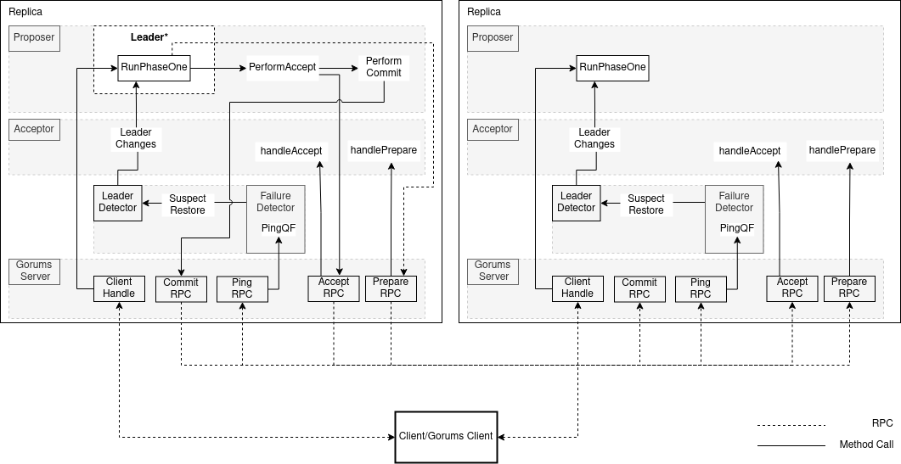

# Multi-Paxos with Gorums

## Background and Resources

This assignment extends the Multi-Paxos implementation in lab 4.
The previous assignment focused on protocol understanding.
However, real communication among the replicas was not specified and implemented in lab 4.

In this assignment, you will extend the replica communication mechanism using [Gorums][1].
Gorums provide the necessary infrastructure for replicas to initiate and respond to the RPCs.
It also provides the necessary abstraction to develop quorum-based operations.
You must use these tools to develop a deployable Multi-Paxos protocol.

## Task Description

You need to implement Multi-Paxos on gorums with failure detector.
You can reuse a significant part of the implementation in lab4 and lab3.
The skeleton code, unit tests and definitions for this assignment can be found in the `gorumspaxos` package.
The implementation of the Multi-Paxos with gorums is divided into the following files:

### The Paxos Replica (replica.go)

This file defines `PaxosReplica`, the base structure which contains the `proposer`, `acceptor` and uses the gorums `failure detector` from [lab3](/lab3/gorumsfd/).
It handles all the `MultiPaxos` service RPCs and invoke the relevant methods of the `proposer` or `acceptor`.
While the leader is responsible for driving the protocol, we recommend that each replica create their own gorums configuration and call `setConfiguration` on the Proposer.
This makes it easier to handle leader changes as the leader already has established a configuration and can readily use it to make quorum calls.

Most of the methods are already given to you, go through their implementation and understand their purpose.
You are requested to complete the methods marked with `TODO(student)`.
Read also the comments above each method to understand the purpose of the method and the expected behavior.

```console
go test -v -run TestClientRequestCommit
```

Some of the tests can print debug messages to the console.
However, to avoid cluttering the output, the debug messages are disabled by default.
To enable debug messages, you can run the tests with the `LOG=1` environment variable set.

```console
LOG=1 go test -v -run TestFiveReplicas
LOG=1 go test -v -run TestLeaderFailure > debug.log
```

Since the output can be quite verbose, you may want to redirect the output to a `debug.log` file as shown above.

### Proposer (proposer.go)

This file defines the `Proposer` structure, which contains the variables for the proposer implementation.
A proposer may be selected as the leader of the Multi-paxos protocol.
The consensus protocol is implemented by calling the RPCs on the configuration.
The Multi-Paxos protocol determines the sequence of the RPCs as shown in the [architecture diagram](#gorums-multi-paxos-architecture).

Proposers subscribe to the leader detector and receive updates about the leader changes.
If a replica is selected as the leader then that replica is responsible for conducting the protocol.
Hence, the proposer should check for the events of leader change before moving to the next phase in the protocol.
Some of the methods in the [proposer.go](proposer.go) are already implemented.
The ones marked with `TODO(student)` are for you to complete.

- `runPhaseOne()`: this method implements the phase one of the Multi-Paxos protocol.
  This function should be called only if the replica is the leader and phase one is not already completed.
  Then, create a `PrepareMsg` with the current round `Crnd` and `Slot` based on `adu+1`, sending this message to all replicas by making a quorum call on the configuration.
  If the prepare quorum call succeeded, set `phaseOneDone` to true.
  If the reply sent from the quorum call contains any accepted PValues, add them to the `acceptMsgQueue`.

  ```console
  go test -run TestRunPhaseOne
  ```

- `runMultiPaxos` should be called in an infinite loop from the replica.
  The loop should handle the following events:

  - Leader change events and call `newLeader` method to update the leader.
  - Stop the replica and exit from the goroutine and close the gorums server.

- `newLeader` should be called when the leader changes.
  This method should update the leader and advance the current round `crnd`.
  Moreover, if the local proposer is the leader, it should reset the `phaseOneDone` variable to `false` to start a new Phase 1.

- `performAccept()`: this method performs the accept-learn phase (also called Phase 2) of the Multi-Paxos.
  The `acceptMsgQueue` contains the accept requests added after the Prepare phase.
  This queue has a higher preference than client requests added to `clientRequestQueue`, so you should handle it before the client request queue.
  Requests from the `clientRequestQueue` are processed only after the `acceptMsgQueue` is empty.
  If there is an accept request message in any of the queues, you should add the accept message to the incremented next slot and current round.
  After creating the proper accept message, you must call the `Accept()` RPC on the configuration to collect learn messages and verify the replies in the `quorumspec`.
  If a valid reply is received from the quorum call, you should return `learnMsg` and nil.

  ```console
  go test -run TestPerformAccept
  ```

- `performCommit()`: this method performs the commit phase of the Multi-Paxos.
  The method receives a `learnMsg` and calls the `Commit()` multicast call on the configuration.
  Note that a multicast call is an asynchronous one-way call and does not expect a response.
  For more information about the `multicast` and other gorums call types see [here](https://github.com/relab/gorums/blob/master/doc/method-options.md).

  ```console
  go test -run TestPerformCommit
  ```

### Quorum Specifications (qspecs.go)

This file implements the quorum functions used in the Multi-Paxos protocol.
The `PaxosQSpec` must be initialized with the quorum size when creating a new `PaxosQSpec`.
You need to implement all the quorum functions.
All quorum functions should check if the received replies are valid (i.e. there is quorum of replies).
Only valid replies should be considered for quorum calculations.
If a valid quorum of replies is received, the quorum functions should return the proper (combined) reply and `true`.
Otherwise it should return `nil` and `false`.
You need to implement the following methods:

- `PrepareQF()`: is the quorum function for the `Prepare()` quorum call.
  It should validate all the received replies.
  If it receives a quorum of valid replies from the acceptors then prepare a reply with the accepted pvalues in increasing slot order.
  You can test your implementation with:

  ```console
  go test  -run TestPrepareQF
  ```

- `AcceptQF()` is the quorum function for the `Accept()` quorum call.
  Check the validity of the learn messages in the replies.
  If a valid quorum of learn messages is received, return a learn message with `true`.
  You can test your implementation with:

  ```console
  go test  -run TestAcceptQF
  ```

- `ClientHandleQF()`: is the quorum function for the `ClientHandle()` quorum call.
  The `ClientHandle()` quorum call is executed by the client to send the request to the replicas, and this quorum function waits for correct replies from a quorum of replicas.
  After receiving the correct replies from a quorum of replicas, it returns the reply to the client.
  You can test your implementation with:

  ```console
  go test  -run TestClientHandleQF
  ```

### Acceptor (acceptor.go)

This file implements the acceptor role of a Paxos replica.
It handles the `Prepare()` and `Accept()` quorum call from a proposer.
You need to implement the following methods:

- `handlePrepare()`: this method processes `PrepareMsg` messages according to the Multi-Paxos algorithm.
  This function should return a `PromiseMsg` if the rules of the protocol are satisfied or `nil` otherwise (similar as in lab4 but only returning one value).

- `handleAccept()`: this method processes `AcceptMsg` messages according to the Multi-Paxos algorithm.
  This function should return a `LearnMsg` if the rules of the protocol are satisfied or `nil` otherwise (similar as in lab4 but only returning one value).

You can test your implementation with:

```console
go test  -run TestAcceptor
```

## Gorums Multi-Paxos Architecture

Below is the architecture diagram of the Gorums-based Multi-Paxos


## Building

You can build the gorums Multi-Paxos by running:

```console
make
```

After completion of the Multi-Paxos implementation, please test your implementation using the following:

```console
go test -run ./...
```

[1]: https://github.com/relab/gorums
